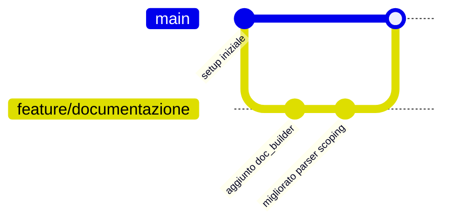

# Guida di Avvio - ODI Mapping Documenter

Guida pratica per sviluppatori che devono eseguire o contribuire al progetto **ODI Mapping Documenter**.

---

## 1. Prerequisiti

| Requisito | Versione | Note |
|-----------|----------|------|
| **Python** | `>= 3.10` | Il codice usa typing moderno (`tuple[...]`, `set[str]`, `dict[str, Any]`) |
| **pip** | Aggiornato | Consigliato: `python -m pip install --upgrade pip` |
| **Git** (per contribuire) | Ultima stabile | Necessario solo per clonare il repository e gestire i commit |
| **Libreria `lxml`** | `>= 5.0.0` | Installata automaticamente da `requirements.txt` |

### Verifica installazione Python

```bash
python --version
```

Dovresti vedere una versione `3.10.x` o superiore.

---

## 2. Installazione

### 2.1 Clonare il repository (opzionale)

```bash
git clone <url-del-repository>/odi-mapping-documenter.git
cd odi-mapping-documenter
```

> Se stai lavorando direttamente sulla cartella del progetto (nessun repository remoto), passa al punto 2.2.

### 2.2 Creare un ambiente virtuale (consigliato)

```bash
# Windows
python -m venv .venv
.venv\Scripts\activate

# Linux / macOS
python3 -m venv .venv
source .venv/bin/activate
```

### 2.3 Installare le dipendenze

Dalla root del progetto:

```bash
pip install -r requirements.txt
```

Le dipendenze installate sono:

| Pacchetto | Versione minima | Necessario |
|-----------|-----------------|:----------:|
| `lxml` | `>=5.0.0` | ✅ Sì (parser) |
| `click` | `>=8.0.0` | ⚠️ Non usato attivamente |
| `pydantic` | `>=2.0.0` | ⚠️ Non usato attivamente |
| `python-dotenv` | `>=1.0.0` | ⚠️ Non usato attivamente |

> Solo `lxml` è indispensabile per il funzionamento. Le altre dipendenze sono superflue allo stato attuale del codice.

### 2.4 Verificare l'installazione

```bash
python -c "from lxml import etree; print('lxml OK:', etree.LXML_VERSION)"
```

---

## 3. Esecuzione

### 3.1 Esecuzione base (processa tutta la cartella `data/`)

```bash
python run.py
```

Il tool:
1. Rileva automaticamente la cartella `data/` di default
2. Processa ricorsivamente **tutti** i file `.xml` presenti
3. Genera gli output in `output/<timestamp>/`
4. Scrive `mapping_sources_targets.json`

### 3.2 Processare un singolo file XML

```bash
python run.py data/prove/MAP_Flow_Fact_Progetti.xml
```

### 3.3 Processare una cartella specifica

```bash
python run.py data/RP_EQUITY_EDH/
```

### 3.4 Filtrare i formati di output

```bash
# Solo documentazione tecnica
python run.py data/prove/MAP_Flow_Fact_Progetti.xml --format technical

# Solo CSV
python run.py data/prove/ --format csv

# Solo diagrammi di flusso
python run.py data/prove/ --format flow

# Solo documentazione business
python run.py data/prove/ --format business
```

### 3.5 Specificare la cartella di output

```bash
python run.py data/prove/ --output-dir my_output/
```

> **Nota:** il tool aggiunge sempre una sottocartella con timestamp: `my_output/<YYYYMMDD_HHMMSS>/`.

### 3.6 Opzioni combinate

```bash
python run.py data/PROGETTO/ --format all --output-dir docs_rilascio/
```

### 3.7 Eseguire direttamente il modulo `main`

Equivalentemente (dalla root):

```bash
python src/main.py <file_o_cartella> [--output-dir <dir>] [--format <formato>]
```

### 3.8 Eseguire il parser alternativo standalone

```bash
python src/parse_odi_xml.py data/prove/MAP_Flow_Fact_Progetti.xml --format both
```

---

## 4. Esempi Pratici

### Esempio 1: Documentare un singolo mapping

```bash
python run.py data/prove/MAP_Flow_Fact_Progetti.xml
```

**Output atteso:**
```
output/<timestamp>/
├── tecnico/MAP_Flow_Fact_Progetti_TECNICO.md
├── business/MAP_Flow_Fact_Progetti_BUSINESS.md
├── flussi/MAP_Flow_Fact_Progetti_FLUSSO.md
├── csv/MAP_Flow_Fact_Progetti_MAPPING_RULES.csv
└── mapping_sources_targets.json
```

### Esempio 2: Documentare un intero progetto in batch

```bash
python run.py data/RP_EQUITY_EDH/
```

**Output atteso:** decine di mapping documentati, ognuno con i 4 formati + `mapping_sources_targets.json` aggregato. Per gli export SmartExport multi-mapping viene generato anche `<export>_INDEX.md`.

### Esempio 3: Generare solo i CSV per un'analisi audit

```bash
python run.py data/PROGETTO/ --format csv
```

---

## 5. Struttura degli Output Generati

```
<output-dir>/<timestamp>/
├── tecnico/                     # *_TECNICO.md (sviluppatori/DBA)
├── business/                    # *_BUSINESS.md (analisti/business)
├── flussi/                      # *_FLUSSO.md (diagrammi Mermaid)
├── csv/                         # *_MAPPING_RULES.csv (Excel-friendly)
├── mapping_sources_targets.json # Riepilogo sorgenti/target
└── <export>_INDEX.md            # Indice SmartExport (solo multi-mapping)
```

I diagrammi Mermaid sono visualizzabili su:
- **GitHub** (rendering nativo)
- **VS Code** (estensione *Markdown Preview Mermaid Support*)
- **Obsidian** (plugin Mermaid integrato)

---

## 6. Esecuzione dei Test e Qualità

> Attualmente la cartella `tests/` è vuota (nessun test implementato). I comandi seguenti sono preparatori.

```bash
# Installare i tool QA
pip install pytest pytest-cov ruff pip-audit bandit

# Lint
ruff check .

# Security audit
pip-audit --format=markdown
bandit -r src/ -f txt

# Test (quando implementati)
pytest tests/ -v --cov=src --cov-report=term-missing
```

Per i dettagli completi consultare [`test_e_qualita.md`](test_e_qualita.md).

---

## 7. Struttura di Riferimento del Progetto

```
odi-mapping-documenter/
├── run.py                 # Entry point (da usare sempre)
├── requirements.txt       # Dipendenze
├── data/                  # File XML di input
├── src/
│   ├── main.py            # CLI + orchestrazione
│   ├── parser.py          # Parser principale (lxml)
│   ├── parse_odi_xml.py   # Parser alternativo (stdlib)
│   ├── doc_builder.py     # Markdown tecnico/business
│   ├── flow_builder.py    # Diagrammi Mermaid
│   └── csv_builder.py     # CSV regole mapping
├── tools/                 # Utility (inspect_odi_fields.py)
├── qa/                    # Framework QA documentale
├── tests/                 # Test (da implementare)
└── documentazione/        # Questa documentazione
```

---

## 8. Contribuire al Progetto

### 8.1 Linee guida

1. **Eseguire sempre dalla root** del progetto (mai dentro `src/`) per non rompere gli import relativi.
2. **Non modificare `parse_odi_xml.py` e `parser.py` in parallelo** per la stessa funzionalità: sono due parser con approcci diversi (stdlib vs lxml). `parser.py` è la versione attiva e completa.
3. **Segnalare i bug** nei messaggi di errore console (in italiano) piuttosto che rimuoverli.
4. Per il QA seguire le indicazioni in [`test_e_qualita.md`](test_e_qualita.md) e `qa/`.

### 8.2 Workflow suggerito



---

## 9. Risoluzione Problemi

| Problema | Soluzione |
|----------|-----------|
| `Errore di importazione dei moduli` | Eseguire con `python run.py` dalla root (aggiunge `src/` al path) |
| `ModuleNotFoundError: No module named 'lxml'` | `pip install -r requirements.txt` |
| File XML non trovato | Verificare il percorso; usare path relativo alla root o assoluto |
| Output con caratteri corrotti | Il tool gestisce UTF-8 automaticamente; assicurarsi di aprire i file con editor UTF-8 |
| Diagramma Mermaid non visibile | Aprire con GitHub/VS Code/Obsidian (non editor Markdown base) |
| Processo lento su file enormi | Il parser carica tutto in RAM; usare export per singolo mapping |
| SmartExport con documenti vuoti | Il fallback globale è attivo; esportare un mapping per file per documenti accurati |

---

*Documentazione generata automaticamente per ODI Mapping Documenter v1.0*