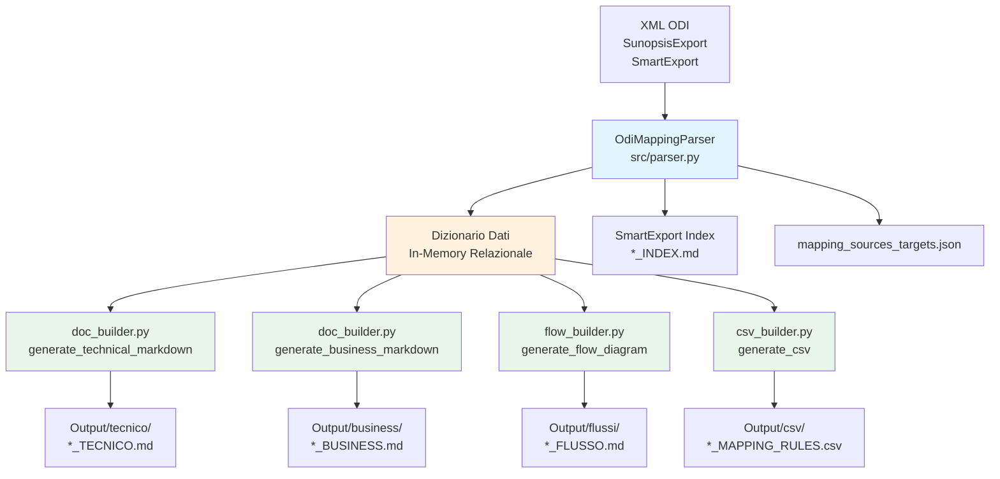
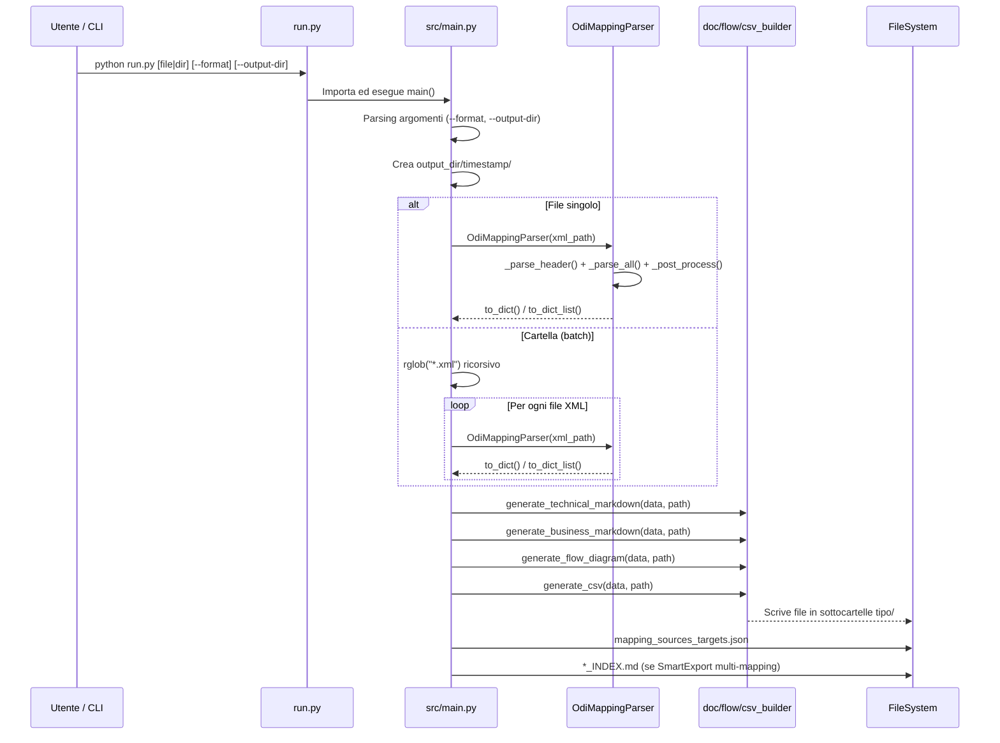

# ODI Mapping Documenter - Documentazione Tecnica

## Visione Generale

**ODI Mapping Documenter** è un tool automatico per la generazione di documentazione tecnica, business e visuale a partire da file di esportazione XML di **Oracle Data Integrator (ODI) 12c** (formato `SunopsisExport` / `SmartExport`).

### Problema Risolto

Gli sviluppatori ODI, DBA e analisti devono spesso documentare mapping complessi per:
- Audit e conformità
- Passaggio di conoscenza tra team
- Analisi d'impatto (change management)
- Revisione codice e code review

La documentazione manuale è costosa, soggetta a errori e rapidamente obsoleta. Questo tool **automatizza completamente il processo**, trasformando l'XML grezzo in documentazione strutturata, navigabile e sempre allineata al codice sorgente.

### Output Generati

Per ogni mapping elaborato vengono prodotti **4 formati complementari** + file di riepilogo:

| File | Formato | Destinatari | Contenuto |
|------|---------|-------------|-----------|
| `<nome>_TECNICO.md` | Markdown | Sviluppatori / DBA | Flusso dati, JOIN, filtri, aggregazioni, espressioni, mappatura attributi target, Knowledge Modules, Execution Units, scenari, SQL generato, dipendenze |
| `<nome>_BUSINESS.md` | Markdown | Analisti / Business | Descrizione narrativa del flusso, regole di business, relazioni tra entità, calcoli spiegati in linguaggio naturale |
| `<nome>_FLUSSO.md` | Markdown + Mermaid.js | Tutti | Diagramma di flusso visuale dei componenti (visualizzabile su GitHub, VS Code, Obsidian) |
| `<nome>_MAPPING_RULES.csv` | CSV (UTF-8 BOM) | Data Engineer / Audit | Una riga per ogni attributo/condizione mappata (espressioni, join, filtri, aggregazioni). Excel-friendly |
| `mapping_sources_targets.json` | JSON | Interoperabilità | Riepilogo sorgenti/target per tutti i mapping elaborati |
| `<export>_INDEX.md` | Markdown | Tutti | Indice riassuntivo per SmartExport multi-mapping con tabella stato e link |

---

## Stack Tecnologico & Linguaggi

| Categoria | Tecnologia | Versione | Note |
|-----------|------------|----------|------|
| **Linguaggio principale** | Python | 3.10+ | Typing moderno, pattern matching |
| **Parsing XML** | `lxml` | ≥5.0.0 | Parser principale ad alte prestazioni (XPath, huge_tree) |
| **Parsing XML alternativo** | `xml.etree.ElementTree` | Stdlib | Parser fallback in `parse_odi_xml.py` (senza dipendenze esterne) |
| **CLI** | `click` | ≥8.0.0 | Gestione argomenti (non usato direttamente in `main.py`, presente in requirements) |
| **Validazione dati** | `pydantic` | ≥2.0.0 | Definizione schemi (non usato attivamente nel codice core) |
| **Configurazione** | `python-dotenv` | ≥1.0.0 | Caricamento variabili d'ambiente (non usato attivamente) |
| **Output** | Markdown, CSV, JSON, Mermaid.js | - | Formati standard aperti |
| **QA Framework** | Custom (skill-based) | - | Struttura `.qa/` per test, lint, security, performance |

---

## Architettura del Sistema

L'architettura segue un pattern **Pipeline ETL** (Extract → Transform → Load) con separazione netta tra parsing, trasformazione e generazione output.



### Componenti Principali

| Componente | File | Responsabilità |
|------------|------|----------------|
| **Parser Principale** | `src/parser.py` | Parsing XML con `lxml`, indicizzazione relazionale in-memory, supporto multi-mapping (SmartExport), scoping per mapping singolo |
| **Parser Alternativo** | `src/parse_odi_xml.py` | Parsing XML con `xml.etree.ElementTree` (stdlib), logica di ricostruzione flusso, helper per dipendenze, scenari, SQL |
| **Generatore Tecnico** | `src/doc_builder.py` | `generate_technical_markdown()`, `generate_business_markdown()` - documentazione dettagliata |
| **Generatore Flusso** | `src/flow_builder.py` | `generate_flow_diagram()` - diagrammi Mermaid.js con stile per tipo componente |
| **Generatore CSV** | `src/csv_builder.py` | `generate_csv()` - export tabellare regole mapping (18 categorie) |
| **Entry Point CLI** | `src/main.py` | Orchestrazione, batch processing, gestione argomenti, output timestamped |
| **Launcher** | `run.py` | Script di avvio rapido dalla root, aggiunge `src/` al path, default su cartella `data/` |

### Flusso Dati Dettagliato



---

## Albero del Progetto

```
odi-mapping-documenter/
├── run.py                          # Launcher entry point (root)
├── requirements.txt                # Dipendenze Python
├── README.md                       # Documentazione utente
├── SKILL.md                        # Metadati per assistenti AI
├── data/                           # File XML input (organizzati per progetto)
├── output/                         # Output generati (gitignored)
│   └── <timestamp>/                # Una sottocartella per esecuzione
│       ├── tecnico/                # *_TECNICO.md
│       ├── business/               # *_BUSINESS.md
│       ├── flussi/                 # *_FLUSSO.md
│       ├── csv/                    # *_MAPPING_RULES.csv
│       ├── mapping_sources_targets.json
│       └── *_INDEX.md              # Indice SmartExport
├── src/                            # Codice sorgente applicazione
│   ├── __init__.py
│   ├── main.py                     # CLI, orchestrazione, batch
│   ├── parser.py                   # Parser principale (lxml) - 2000+ righe
│   ├── parse_odi_xml.py            # Parser alternativo (stdlib) - 1300+ righe
│   ├── doc_builder.py              # Generatori Markdown tecnico/business
│   ├── flow_builder.py             # Generatore diagrammi Mermaid
│   └── csv_builder.py              # Generatore CSV regole mapping
├── tools/                          # Utility di sviluppo
│   └── inspect_odi_fields.py       # Ispettore campi XML ODI (solo metadati)
├── qa/                             # Framework Quality Assurance
│   ├── skill.md                    # Skill QA per agenti AI
│   └── references/
│       ├── report-template.md      # Template report QA
│       ├── toolstack.md            # Stack tool per categoria
│       └── writing-guide.md        # Guida scrittura test
└── tests/                          # Test (attualmente vuoto - solo __init__.py)
    └── __init__.py
```

### Descrizione Cartelle Principali

| Cartella | Scopo |
|----------|-------|
| `src/` | Core application - parsing, building, orchestration |
| `data/` | Input XML organizzati per progetto/ambiente ODI |
| `output/` | Artefatti generati (timestampati per esecuzione) |
| `tools/` | Script utility per analisi/debug XML (non per produzione) |
| `qa/` | Framework QA declarativo per agenti AI (non tool runtime) |
| `tests/` | Placeholder per futuri unit/integration test |

---

## Indice della Documentazione

| File | Descrizione |
|------|-------------|
| [`index.md`](index.md) | **Questo file** - Panoramica progetto, architettura, stack, albero |
| [`api_funzioni.md`](api_funzioni.md) | Mappa analitica completa di tutte le funzioni/classi per file sorgente |
| [`configurazione.md`](configurazione.md) | Gestione ambiente, variabili, profili, file configurazione |
| [`test_e_qualita.md`](test_e_qualita.md) | Suite test, copertura, istruzioni esecuzione, QA framework |
| [`guida_avvio.md`](guida_avvio.md) | Guida pratica per sviluppatori: prerequisiti, installazione, esecuzione |

---

*Documentazione generata automaticamente per ODI Mapping Documenter v1.0*