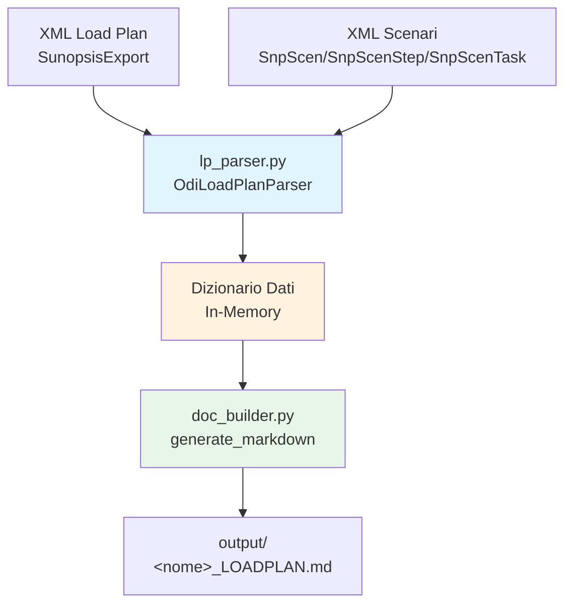

# ODI Load Plan Documenter - Documentazione Tecnica

## Visione Generale

**ODI Load Plan Documenter** (cartella `lp_doc_test`) è un sottoprogetto di **ODI Mapping Documenter** che genera documentazione Markdown leggibile per i **Load Plan** di **Oracle Data Integrator (ODI)** e per gli **Scenari** ad essi associati.

Mentre il progetto principale documenta i *mapping*, questo strumento si concentra sulla **stratificazione di esecuzione**: i Load Plan orchestrano scenari, passaggi e task in ordine, con agenti di schedulazione, variabili e gestione errori.

### Problema Risolto

La documentazione dei Load Plan in ODI è normalmente consultabile solo nella console ODI o tramite esportazioni XML poco leggibili. Questo strumento:
- **Parsea l'XML di esportazione** (formato `SunopsisExport`) dei Load Plan.
- **Ricostruisce l'albero gerarchico** dei passaggi (step).
- **Collega** ogni step allo scenario associato e ne elenca i passaggi interni, i Knowledge Module e i task SQL.
- **Genera** un unico file Markdown (`<nome>_LOADPLAN.md`) navigabile e versionabile.

### Output Generati

| File | Formato | Contenuto |
|------|---------|-----------|
| `<safe_name>_LOADPLAN.md` | Markdown | Informazioni generali LP, agenti di schedulazione, struttura gerarchica degli step, variabili LP e step, scenari collegati con passaggi e task SQL |

---

## Architettura



### Componenti Principali

| Componente | File | Responsabilità |
|------------|------|----------------|
| **Entry Point CLI** | `run.py` | Classificazione XML (`lp` / `scenario` / `other`), gestione argomenti, orchestrazione |
| **Parser** | `lp_parser.py` | Classe `OdiLoadPlanParser`, parsing di tutti i tipi di oggetto, ricostruzione albero, collegamento scenari |
| **Generatore Markdown** | `doc_builder.py` | `generate_markdown()` - formattazione del documento finale |

### Flusso Dati

```mermaid
sequenceDiagram
    participant User as Utente / CLI
    participant Run as run.py
    participant Parser as OdiLoadPlanParser
    participant Builder as doc_builder
    participant FS as FileSystem

    User->>Run: python run.py &lt;file_or_cartella&gt; [--scenarios ...]
    Run->>Parser: OdiLoadPlanParser(lp_file, scenario_paths)
    Parser->>Parser: _parse_loadplan_file() + _parse_scenario_file()
    Parser->>Parser: _build_step_tree() + _link_scenarios_to_steps()
    Parser-->>Run: to_dict()
    Run->>Builder: generate_markdown(data, output_path)
    Builder-->>FS: output/<name>_LOADPLAN.md
```

---

## Tipi di Oggetto Supportati (parsing XML)

Provenienti dal Load Plan file:

| Classe | Ruolo |
|--------|-------|
| `SnpLoadPlan` | Definizione base del Load Plan (nome, ID, logging, metadati) |
| `SnpPlanAgent` | Agente di esecuzione e sua schedulazione (job, repeat, tipi) |
| `SnpLpStep` | Singolo passo del Load Plan (tipo, contexto, gestione errori, ordinamento, gerarchia) |
| `SnpLpVar` | Variabile del Load Plan a livello LP |
| `SnpLpStepVar` | Variabile associata a uno step |
| `SnpFKXRef` | Foreign-key reference verso oggetti ODI |

Dai file di scenario:

| Classe | Ruolo |
|--------|-------|
| `SnpScen` | Scenario ODI (nome, versione, mapping di riferimento) |
| `SnpScenStep` | Passo dello scenario (mapping/package/variabile del knowledge module) |
| `SnpScenTask` | Task dello scenario con definizione SQL (`DefTxt`/`ColTxt`) |

---

## Albero del Progetto

```
lp_doc_test/
├── run.py                        # Entry point CLI
├── lp_parser.py                 # Parser XML OdiLoadPlanParser
├── doc_builder.py               # Generatore Markdown
├── LoadPlan/                    # File XML di esempio (LP e scenari)
│   ├── LP_.xml
└── output/                      # Documentazione Markdown generata
    ├── LP_LOADPLAN.md

```

---

## Etichette utilizzate dal generatore

Il generatore converte i codici ODI in etichette human-readable.

### Step Load Plan

| Codice | Etichetta |
|--------|-----------|
| `SE` | Sequence Executor |
| `S` | Simple Step |
| `F` | For Each |
| `W` | While |
| `SR` | Subroutine |

### Comportamento su errore (`ExceptBehavior`)

| Codice | Etichetta |
|--------|-----------|
| `R` | Ignore and resume |
| `S` | Stop |
| `C` | Stop all |

### Tipo di restart

| Codice | Etichetta |
|--------|-----------|
| `SF` | From failed step |
| `ST` | From start |
| `S` | From step |

### Task Scenari

| Codice | Etichetta |
|--------|-----------|
| `L` | Logical |
| `J` | SQL / JDBC |
| `C` | Custom / OS command |
| `E` | Export |
| `I` | Import |

### Step Scenario

| Codice | Etichetta |
|--------|-----------|
| `M` | Mapping |
| `P` | Package |
| `V` | Variable |

---

## Indice della Documentazione

| File | Descrizione |
|------|-------------|
| [`index.md`](index.md) | **Questo file** - Panoramica, architettura, stack, oggetti supportati, albero |
| [`api_funzioni.md`](api_funzioni.md) | Mappa completa di classi, metodi e funzione per file sorgente |
| [`configurazione.md`](configurazione.md) | Input/Output, argomenti CLI, dipendenze |
| [`test_e_qualita.md`](test_e_qualita.md) | Test manuali, scenari limite, casi d'uso |
| [`guida_avvio.md`](guida_avvio.md) | Prerequisiti, installazione, esempi di esecuzione |

---

*Documentazione generata automaticamente per ODI Load Plan Documenter v1.0*