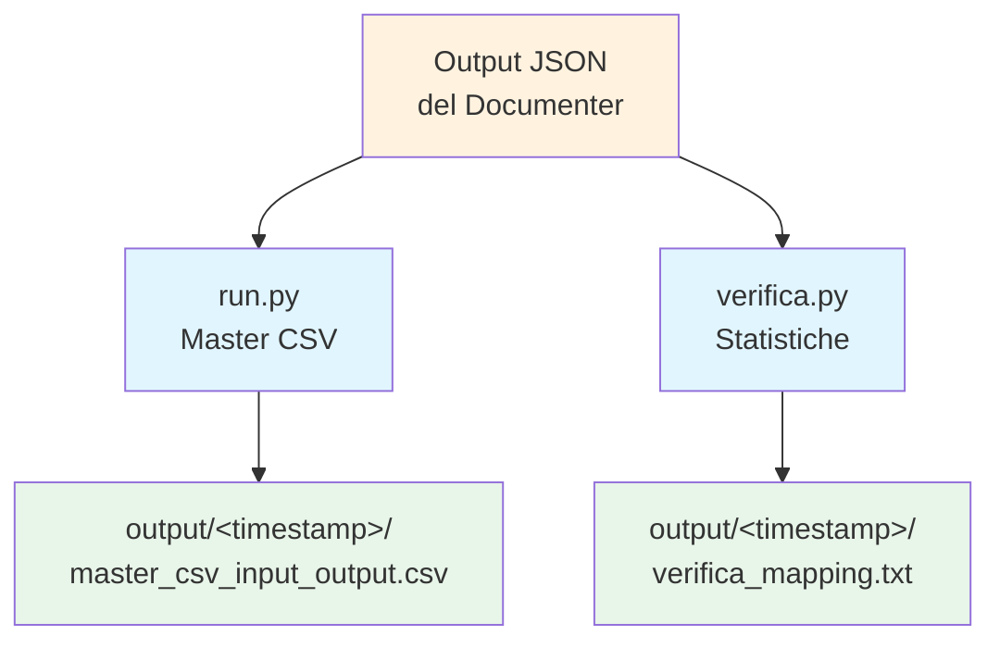

# Master CSV Generator - Documentazione Tecnica

## Visione Generale

**Master CSV Generator** è un sottoprogetto di **ODI Mapping Documenter** che produce una **vista tabellare unificata** di tutti i mapping ODI in formato CSV, a partire dagli output JSON generati dal progetto principale.

Lo strumento risolve il problema di dover consultare decine di file JSON individuali per rispondere a domande di tipo:
- *Quali tabelle usa un determinato mapping?*
- *Quali mapping scrivono su un dato schema?*
- *Qual è l'inventario complessivo di sorgenti/target per progetto?*

Il CSV risultante può essere aperto direttamente in **Excel**, **Power BI** o qualsiasi strumento di analisi dati.

### Funzionalità Principali

| Funzionalità | Descrizione |
|--------------|-------------|
| **Scansione ricorsiva** | Trova automaticamente tutti i file `.json` presenti in una directory (anche in sottocartelle) |
| **Estrazione righe** | Da ogni mapping estrae una riga per sorgente (`input`) e una per target (`output`) |
| **Identificazione progetto** | Il progetto viene dedotto dal nome della cartella padre del file JSON |
| **CSV unificato** | Genera un unico file `master_csv_input_output.csv` con colonne `progetto, mapping, schema, table, tipo` |
| **Encoding UTF-8 BOM** | Compatibile con Excel (UTF-8-SIG) |
| **Output timestampato** | Ogni esecuzione salva i risultati in una sottocartella `output/<timestamp>/` |
| **Script di verifica** | `verifica.py` produce un report statistico dettagliato per progetto e per mapping |

---

## Architettura

Il progetto è intenzionalmente **minimale e modulare**: due script Python indipendenti, senza dipendenze esterne oltre la standard library.



### Componenti

| Componente | File | Responsabilità |
|------------|------|----------------|
| **Generatore CSV** | `run.py` | Scansione ricorsiva JSON, estrazione righe, scrittura CSV unificato |
| **Verifica Statistiche** | `verifica.py` | Conteggi per progetto/mapping: schemi, tabelle, sorgenti, target |

### Formato del CSV Generato

| Colonna | Esempio | Descrizione |
|---------|---------|-------------|
| `progetto` | `PROGETTO_ESEMPIO` | Nome del progetto ODI (dalla cartella padre del JSON) |
| `mapping` | `M_ANAG` | Nome del mapping |
| `schema` | `STG` | Schema coinvolto (sorgente o target) |
| `table` | `ANAG_CUSTOMER` | Tabella coinvolta |
| `tipo` | `input` / `output` | Ruolo della tabella nel mapping |

---

## Stack Tecnologico

| Categoria | Tecnologia | Note |
|-----------|------------|------|
| **Linguaggio** | Python 3.10+ | Solo standard library |
| **Moduli stdlib** | `csv`, `json`, `sys`, `datetime`, `pathlib`, `collections`, `typing` | Nessuna dipendenza esterna richiesta |
| **Formato input** | JSON | Struttura generata dal progetto principale (`sources` / `targets`) |
| **Formato output** | CSV (UTF-8 BOM) e TXT | Aperti con qualsiasi editor o foglio di calcolo |

---

## Albero del Progetto

```
master-csv/
├── run.py                          # Generatore Master CSV (entry point)
├── verifica.py                     # Report statistiche mapping
└── output/                         # Output generati (una cartella per esecuzione)
    └── <timestamp>/
        ├── master_csv_input_output.csv   # CSV unificato input/output
        └── verifica_mapping.txt          # Report statistico (da verifica.py)
```

---

## Indice della Documentazione

| File | Descrizione |
|------|-------------|
| [`index.md`](index.md) | **Questo file** - Panoramica, architettura, stack, albero |
| [`api_funzioni.md`](api_funzioni.md) | Mappa completa di funzioni e strutture dati per file sorgente |
| [`configurazione.md`](configurazione.md) | Setup, argomenti CLI, input attesi, output |
| [`test_e_qualita.md`](test_e_qualita.md) | Test manuali suggeriti, casi d'uso, limiti |
| [`guida_avvio.md`](guida_avvio.md) | Prerequisiti, installazione, esempi di esecuzione |

---

*Documentazione generata automaticamente per Master CSV Generator v1.0*
