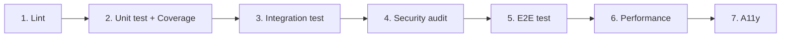

# Test e Qualità - ODI Mapping Documenter

Questo documento descrive lo stato attuale della suite di test, la struttura QA del progetto e le istruzioni per lanciare test, coverage e linter.

---

## 1. Stato Attuale della Suite di Test

> **Stato complessivo: 🟡 PARZIALE**

Il progetto è **attualmente senza test implementati**. La cartella `tests/` contiene solo il marker `__init__.py` (file vuoto che rende la cartella un package Python) e nessun file `test_*.py`. Tuttavia, il progetto include un **framework QA documentale** (`qa/`) con skill, template e tool stack di riferimento, predisposto per guidare l'implementazione futura dei test.

### Struttura della cartella `tests/`

```
tests/
└── __init__.py          # Marker package - nessun test implementato
```

---

## 2. Struttura QA del Progetto (`qa/`)

Il progetto contiene un framework QA *declarativo* (skill-based) destinato ad agenti AI e sviluppatori. La sua struttura è:

```
qa/
├── skill.md                     # Skill QA: principi, fasi, workflow, config
└── references/
    ├── report-template.md       # Template Markdown per report (unit, coverage, security, perf, a11y)
    ├── toolstack.md             # Stack tool per categoria/linguaggio (pytest, ruff, bandit, ecc.)
    └── writing-guide.md         # Guida scrittura test per categoria (pattern AAA, naming, ecc.)
```

### Principi del framework QA (da `qa/skill.md`)

| Principio | Descrizione |
|-----------|-------------|
| Struttura `.qa/` | Tutto il QA vive in `.qa/` nella root (mai sparpagliare config) |
| Config unica | Un file `qa.config.json` governa tutto (non ancora creato) |
| Report in Markdown | Ogni run produce file `.md` leggibili in repo/wiki |
| Idempotente | Rieseguire non duplica file né rompe nulla |
| Modalità RETROFIT | Per codice esistente: testano il comportamento *attuale* |
| Modalità TDD | Per nuovo codice: test-first (red → green → refactor) |

### Sequenza di esecuzione standard raccomandata



---

## 3. Mappatura Copertura Test

Non essendoci test implementati, la tabella di correlazione test → sorgente è la seguente:

| File sorgente | File di test previsto | Stato |
|---------------|----------------------|:-----:|
| `src/main.py` | `tests/test_main.py` | 🔴 Da creare |
| `src/parser.py` | `tests/test_parser.py` | 🔴 Da creare |
| `src/parse_odi_xml.py` | `tests/test_parse_odi_xml.py` | 🔴 Da creare |
| `src/doc_builder.py` | `tests/test_doc_builder.py` | 🔴 Da creare |
| `src/flow_builder.py` | `tests/test_flow_builder.py` | 🔴 Da creare |
| `src/csv_builder.py` | `tests/test_csv_builder.py` | 🔴 Da creare |
| `run.py` | `tests/test_run.py` | 🔴 Da creare |
| `tools/inspect_odi_fields.py` | `tests/test_inspect_odi_fields.py` | 🔴 Da creare |

> 🔴 = non implementato · 🟡 = parziale · 🟢 = implementato e passante

---

## 4. Scenari di Test Raccomandati

Sulla base dell'analisi del codice, ecco i **principali scenari** che dovrebbero essere coperti dai futuri test:

### 4.1 Parser (`src/parser.py`)

| # | Scenari |
|---|---------|
| 1 | Parsing di un file XML con un singolo mapping (`to_dict()` restituisce struttura completa) |
| 2 | Rilevamento SmartExport multi-mapping (`is_smart_export()`, `mapping_ids()`, `is_multi_mapping()`) |
| 3 | Scoping corretto: `to_dict_for_mapping()` seleziona solo gli oggetti del mapping richiesto |
| 4 | Fallback globale quando manca ownership (`scoping_fallback_used = True`) |
| 5 | Normalizzazione ID mapping tramite alias (IMapping, GlobalId, ecc.) |
| 6 | `_normalize_qualified_name()` rimuove prefissi tecnologici (ORACLE_, M_, ecc.) |
| 7 | `find_sources_and_targets()` identifica correttamente SOURCE/TARGET/LOOKUP |
| 8 | `get_aggregate_info()` distingue GROUP BY da funzioni di aggregazione |
| 9 | `get_mapping_flow()` costruisce nodi/archi validi per il diagramma |
| 10 | `get_generated_sql()` estrae DEF/COL dai task degli scenari |

### 4.2 Builder (doc/flow/csv)

| # | Scenari |
|---|---------|
| 1 | `generate_technical_markdown()` produce header con nome mapping corretto |
| 2 | `generate_business_markdown()` traduce operatori SQL in linguaggio naturale |
| 3 | `_humanize_condition()` converte `=`, `<>`, `IS NULL` correttamente |
| 4 | `generate_flow_diagram()` genera diagramma Mermaid valido (nodi e archi) |
| 5 | `generate_csv()` scrive tutte le 10+ categorie di righe |
| 6 | `generate_csv()` usa encoding `utf-8-sig` (BOM presente) |
| 7 | `generate_csv()` gestisce mapping senza regole (riga INFO) |

### 4.3 CLI (`src/main.py`, `run.py`)

| # | Scenari |
|---|---------|
| 1 | `safe_filename()` sostituisce caratteri non alfanumerici con `_` |
| 2 | Modalità singolo file genera 4 output in sottocartelle corrette |
| 3 | Modalità batch processa tutti i file XML ricorsivamente |
| 4 | `--format` filtra correttamente i formati generati |
| 5 | `--output-dir` personalizza la cartella radice (con timestamp) |
| 6 | `process_multi_mapping()` genera `*_INDEX.md` con stato ✅/❌ |
| 7 | Gestione errori: file inesistente → messaggio chiaro, exit code ≠ 0 |

---

## 5. Istruzioni di Esecuzione

### 5.1 Installazione delle dipendenze

```bash
pip install -r requirements.txt
```

### 5.2 Strumenti QA raccomandati (dal framework `qa/`)

Per eseguire test, coverage e lint secondo il toolstack definito in `qa/references/toolstack.md`:

```bash
# Test runner e coverage
pip install pytest pytest-cov pytest-asyncio

# Linter Python (fast, sostituisce flake8+isort)
pip install ruff

# Security audit
pip install pip-audit bandit
```

### 5.3 Esecuzione dei test

```bash
# Da root del progetto - esecuzione di base
pytest tests/ -v

# Con coverage e soglia
pytest tests/ \
  --cov=src \
  --cov-report=term-missing \
  --cov-report=json:.qa/coverage/reports/coverage.json \
  --cov-fail-under=80 \
  -v
```

> **Nota:** al momento `pytest tests/` non trova test da eseguire (cartella vuota). I comandi diventano operativi appena implementati i test.

### 5.4 Linter

```bash
# Controllo lint completo
ruff check . --output-format=github

# Fix automatico (da proporre e applicare con cautela)
ruff check . --fix
```

### 5.5 Security audit

```bash
# Dipendenze vulnerabili
pip-audit --format=markdown

# Vulnerabilità nel codice sorgente
bandit -r src/ -f txt
```

### 5.6 Performance / Profiling

```bash
# Profiling con cProfile (built-in)
python -m cProfile -o .qa/performance/reports/profile.pstats src/main.py data/prove/SmartExport.xml

# Lettura report
python -c "import pstats; p = pstats.Stats('.qa/performance/reports/profile.pstats'); p.sort_stats('cumulative'); p.print_stats(20)"
```

### 5.7 Struttura report QA (da template)

Dopo ogni run, generare il report Markdown in `.qa/<categoria>/reports/` seguendo `qa/references/report-template.md`:

| Categoria | Struttura report | Tool |
|-----------|------------------|------|
| Unit | `.qa/unit/reports/YYYY-MM-DD_unit.md` | pytest |
| Coverage | `.qa/coverage/reports/` | pytest-cov |
| Lint | `.qa/lint/reports/YYYY-MM-DD_lint_python.md` | ruff |
| Security | `.qa/security/reports/YYYY-MM-DD_security.md` | pip-audit + bandit |
| Performance | `.qa/performance/reports/` | cProfile / py-spy |

---

## 6. Segnali di Allerta (da `qa/skill.md`)

Il framework QA richiede di segnalare esplicitamente quando:

1. **Coverage scende sotto la soglia** (`coverage.min_threshold` in `qa.config.json`, default 80%)
2. **Vulnerabilità HIGH/CRITICAL** trovate da pip-audit/bandit
3. **Test E2E flaky** (non deterministici)
4. **Tempo di risposta oltre il budget** (`performance.budget_ms`)
5. **File sorgente senza test associati** (copertura strutturale zero)

---

## 7. Migliorie Consigliate per la Qualità

| # | Azione | Priorità |
|---|--------|:--------:|
| 1 | Implementare unit test per `src/parser.py` (scoping multi-mapping è la parte più critica) | 🔴 Alta |
| 2 | Implementare test per `src/csv_builder.py` e `src/doc_builder.py` | 🔴 Alta |
| 3 | Creare `qa.config.json` con soglie e stack dichiarati | 🟡 Media |
| 4 | Rimuovere dipendenze inutilizzate (`click`, `pydantic`, `python-dotenv`) dai requisiti | 🟡 Media |
| 5 | Aggiungere test E2E su un file SmartExport di esempio | 🟢 Bassa |

---

*Documentazione generata automaticamente per ODI Mapping Documenter v1.0*